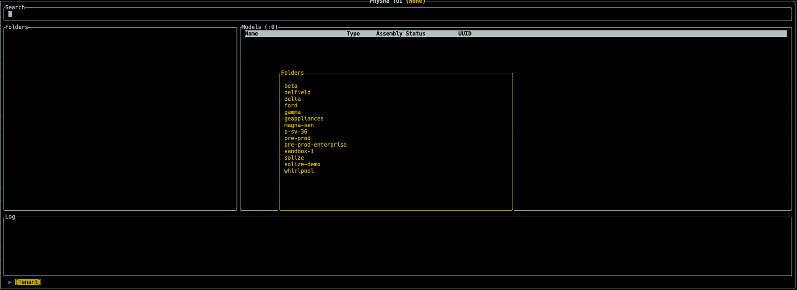

# PTUI User Guide

## Introduction

PTUI stands for Physna Terminal User Interface. TUIs are type of applications that execute in a terminal session. 

The terminal is by nature text-based and therefore has limitations in how the data is presented. However, executing applications in a terminal has some unique advantages in special cases.

* Can run locally on your computer, or remotelly via SSH connection
* Does not need any additional software, such as a web-browser
* It is very responsive and lightweigh
* It is easy to install

## Prerequisites

... to be continued ...

## System requirements

... to be continued ...

## Installation

... to be continued ...

1. Download the achive
2. Extract the binary
3. Configure your path (optional)
4. Configure the application

## Starting the app

````bash
ptui
````

## Tenants

### What is a tenant?

... to be continued ...

### Selecting a tenant

When you start the application, it will attempt to read from the configuration file. If successful, it will will display the list of available tenants.

